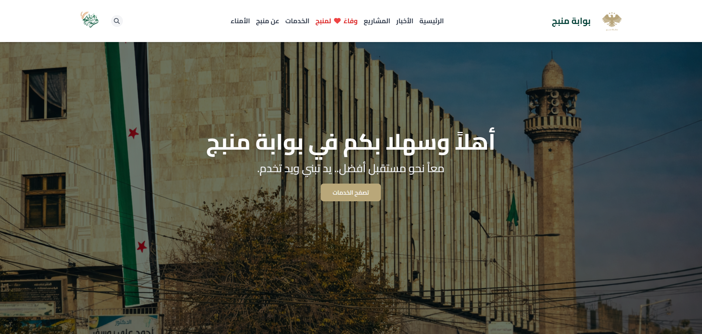
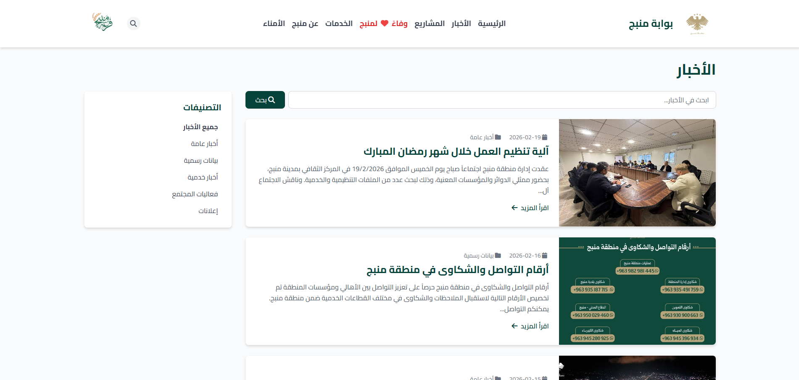
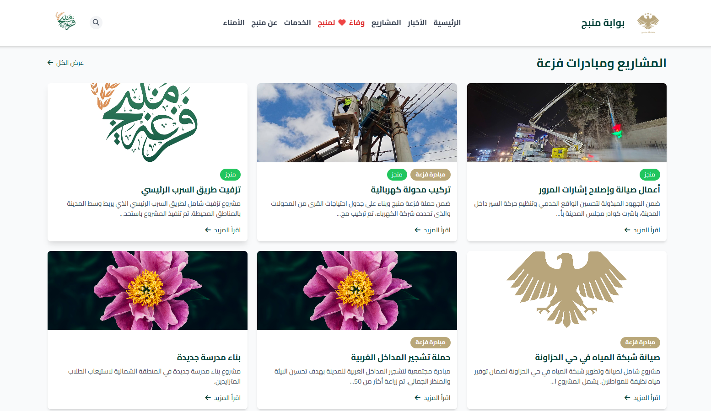
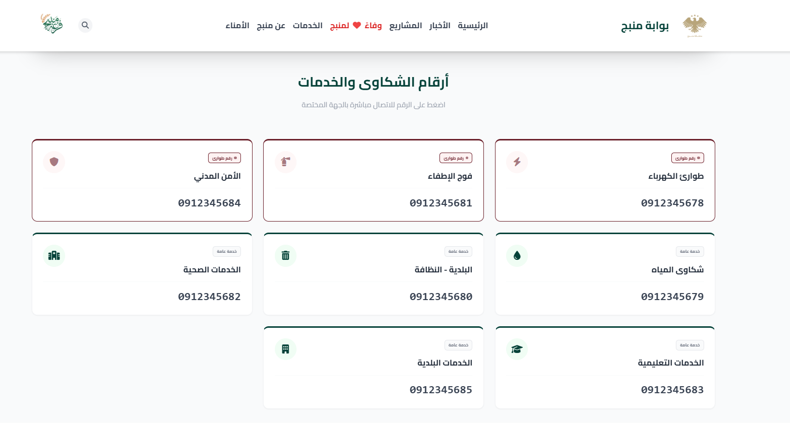
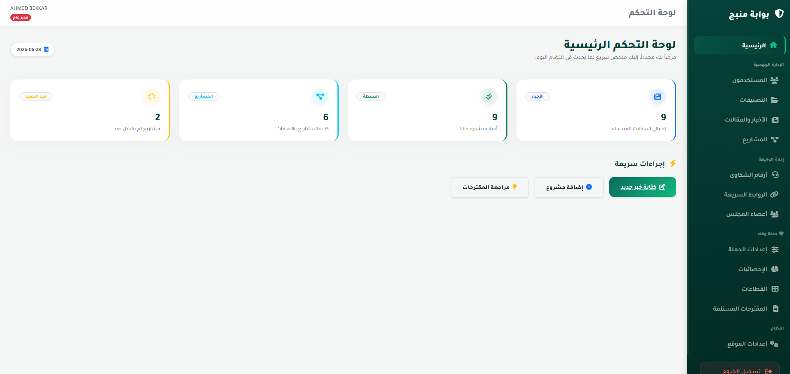
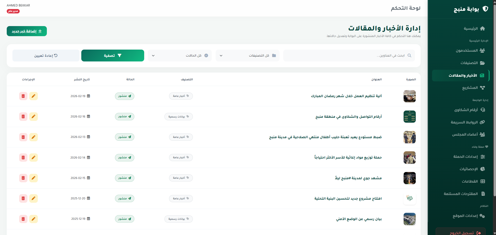
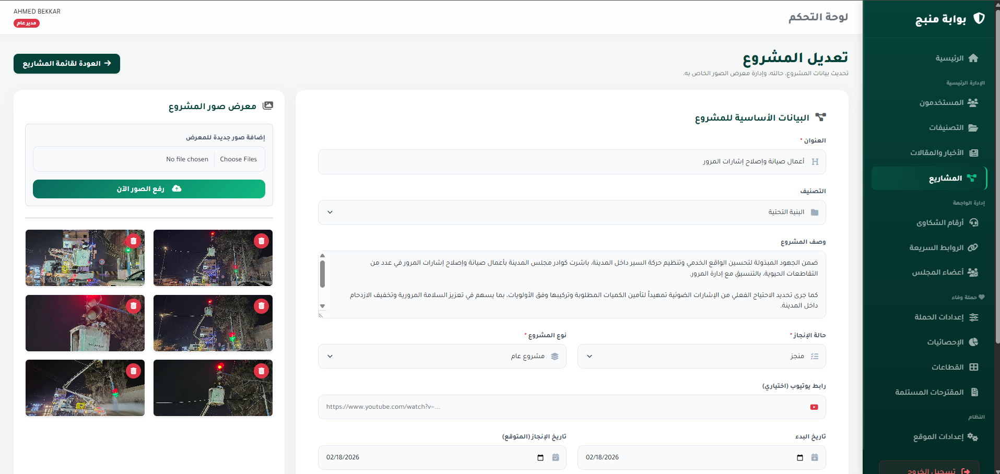

<p align="center">
  <h1 align="center">🏛️ Manbij Civil Portal</h1>
  <h3 align="center">Regional Administrative & Civic Information Platform</h3>
</p>

<p align="center">
  <a href="https://manbijregion.org/" target="_blank">
    
  </a>
</p>

<p align="center">
  
  
  
  
  
  
  
  
</p>

---

## 🔗 Live Deployment

> This system is fully deployed, SEO-optimized, and operational in a live production environment.

**👉 [https://manbijregion.org/](https://manbijregion.org/)**

---

## 📋 Overview

The **Manbij Civil Portal** is a full-stack administrative and civic information management system engineered to digitize and centralize the public-service operations of a regional municipality. The platform serves dual audiences: administrators managing content through a secure, role-partitioned control panel, and citizens accessing a rich, RTL-optimized portal for news, development projects, board member directories, and interactive proposal submissions. Its primary business value is the complete elimination of manual administrative bottlenecks, replacing fragmented communication channels with a single, auditable, high-performance digital infrastructure.

---

## 🛠️ Technology Stack

### Backend
| Technology | Version | Role |
|---|---|---|
| **PHP** | `^8.2` | Core server-side language |
| **Laravel** | `^12.0` | Primary application framework (MVC, Routing, ORM, Auth) |
| **Laravel Breeze** | `^2.3` | Authentication scaffolding (session-based) |
| **Eloquent ORM** | — | Database abstraction and relationship management |
| **Mews Purifier** | `^3.4` | Server-side HTML sanitization (XSS mitigation) |
| **Laravel Tinker** | `^2.10` | Runtime REPL for inspection and debugging |
| **Laravel Sail** | `^1.41` | Docker-based local development environment |

### Frontend
| Technology | Version | Role |
|---|---|---|
| **Laravel Blade** | — | Server-side templating engine |
| **Tailwind CSS** | `^3.1` | Utility-first styling framework (RTL-configured) |
| **Alpine.js** | `^3.4` | Declarative, lightweight DOM reactivity |
| **Vite** | `^7.0` | Asset bundler and hot-module replacement server |
| **Axios** | `^1.11` | Promise-based HTTP client for AJAX interactions |
| **PostCSS / Autoprefixer** | `^8` / `^10` | CSS transformation pipeline |

### Database & Infrastructure
| Technology | Role |
|---|---|
| **MySQL / MariaDB** | Primary production relational database |
| **SQLite** | Lightweight driver for testing and local orchestration |
| **Laravel Cache** | File/Redis-based query result caching |
| **Hostinger** | Live production hosting and domain management |

---

## ✨ Key Features

1. **🗂️ Multi-Entity Dynamic CMS**
   Full `Create / Read / Update / Delete` lifecycle management for **News Posts**, **Announcement Categories**, **Municipal Projects** (with multi-image galleries), **Board Member Directories**, **Emergency Hotline Contacts**, and **Quick Navigation Links** — all handled by a unified, reusable `HandlesImageUploads` trait that manages file persistence and cleanup automatically.

2. **📣 "Wafaa" Civic Campaign Subsystem**
   A dedicated community engagement module enabling citizens to submit development proposals with secure file attachments. Backed by a fully-featured admin interface for managing campaign settings, sector metrics, and proposal lifecycle — including file download, status tracking, and administrator replies.

3. **🔐 Dual-Chamber Role-Based Access Control (RBAC)**
   The administrative routing architecture enforces a strict two-tier permission model:
   - **Open Chamber** (`role:admin,editor`): Content creation, editing, and publication.
   - **Closed Chamber** (`role:admin`): Exclusive access to destructive operations (deletions), user account management, system-wide settings, and the Wafaa Campaign administration.
   Enforced entirely via a custom `RoleMiddleware` registered in the application's HTTP kernel.

4. **📋 Enterprise-Grade Audit Logging**
   A dedicated `AuditLog` model transparently records every significant administrative action — including the performing user, a human-readable action description, and the client's IP address — creating a full, tamper-resistant operational trail for governance and accountability.

5. **⚡ Intelligent Content Caching**
   Cache invalidation is embedded directly into the content lifecycle. A `clearPostCache()` helper is invoked on every `store`, `update`, and `destroy` operation, atomically purging stale `homepage_data`, `news_list`, and `latest_posts` cache keys and ensuring public pages always reflect current data with minimal database overhead.

6. **🔍 SEO & Sitemap Engine**
   A dedicated `SitemapController` generates a dynamic `sitemap.xml` at runtime, indexing all published news and project slugs automatically. Public search endpoints are rate-limited (`throttle:10,1`) to prevent scraping, and all public routes use human-readable, SEO-friendly URL slugs.

7. **📱 Responsive RTL-Optimized Interface**
   The entire public-facing frontend is architected for Arabic Right-to-Left (RTL) presentation using Tailwind CSS's responsive utility system. The interface adapts fluidly across all viewport sizes without a single line of custom media query JavaScript.

---

## 🏗️ System Architecture & Security

### Architectural Pattern: MVC with Clean Separation of Concerns

The application is built on a strict **Model-View-Controller (MVC)** architecture, extended with the following patterns for maintainability and scalability:

```
app/
├── Http/
│   ├── Controllers/
│   │   ├── Admin/          # Secured admin controllers (DashboardController, PostController, etc.)
│   │   ├── Public/         # Public-facing controllers (HomeController, NewsController, etc.)
│   │   └── SitemapController.php
│   ├── Middleware/
│   │   └── RoleMiddleware.php   # Custom RBAC enforcement
│   └── Requests/
│       ├── StorePostRequest.php  # Decoupled validation logic
│       └── UpdatePostRequest.php
├── Models/
│   ├── AuditLog.php        # Operational audit trail
│   ├── Post.php            # News entity with slugs & category relationship
│   ├── Project.php         # Municipal project with gallery relationship
│   └── ...
└── Traits/
    └── HandlesImageUploads.php   # Reusable media management
```

- **Form Request Classes** strictly decouple input validation from controller business logic.
- **Reusable Traits** centralize cross-cutting file-system operations, keeping controllers thin.
- **Invokable Single-Action Controllers** are used for simple public routes (e.g., `HomeController`, `AboutController`), improving readability.
- **Eloquent Relationships** (`belongsTo`, `hasMany`) model data associations at the ORM layer.

### Security Implementation

| Layer | Mechanism | Protection Against |
|---|---|---|
| **Authentication** | Laravel Breeze (session-based) | Unauthorized access |
| **Authorization** | Custom `RoleMiddleware` + route grouping | Privilege escalation |
| **Input Validation** | `FormRequest` classes with strict rules | Malformed & malicious input |
| **Output Sanitization** | Mews Purifier (`mews/purifier`) | Cross-Site Scripting (XSS) |
| **Database Queries** | Eloquent ORM parameterized statements | SQL Injection |
| **Request Throttling** | Laravel `throttle` middleware | Brute-force & DDoS |
| **Form Submissions** | Laravel CSRF token verification | Cross-Site Request Forgery (CSRF) |
| **Admin Audit Trail** | `AuditLog` model (IP + user + action) | Untracked administrative changes |

---

## 🚀 Deployment & Hosting

The project is fully deployed to a live production environment managed on **[Hostinger](https://www.hostinger.com/)**.

- **Build Pipeline:** Frontend assets are compiled and minified via `vite build`. PHP dependencies are installed with `composer install --optimize-autoloader --no-dev` for maximum autoload performance.
- **Search Engine Optimization:** The platform is fully optimized for search engine indexing via a programmatically generated `sitemap.xml`, structured semantic HTML, canonical URL management, and fine-tuned page response times.
- **Database Migrations:** Schema is managed entirely via Laravel Migrations, enabling version-controlled, repeatable deployments across all environments.

---

## 🖼️ Screenshots

### 🌐 Public Portal

| Homepage | News |
|----------|------|
|  |  |

| Projects | Public Services |
|----------|-----------------|
|  |  |

### ⚙️ Administrative Control Panel

| Dashboard | Posts |
|-----------|-------|
|  |  |

| Project Editor | Citizen Proposals |
|----------------|-------------------|
|  |  |

| RBAC |
|------|
|  |

## 📄 License & Portfolio Notice

This repository is published exclusively as a **professional portfolio showcase**. No source code is included. All intellectual property, business logic, and design assets are proprietary and belong to the respective project owners.
